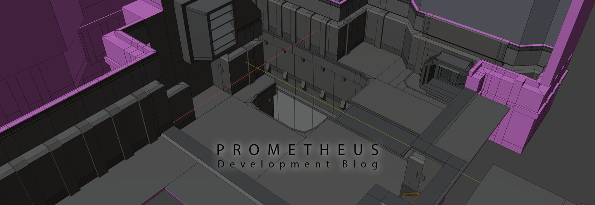 

Prometheus is a demonstration map for my texture pack. 
This map brings together all the unfinished components that have accumulated over the years, 
including the map 'Stahl'. This will be my final (last) map for Unvanquished.

19.01.2024:

-The human spawn site (called "Outpost") is mostly complete. The main spawn point is located in the center of the ground floor.  
This area is flanked by two pipes, which all aliens except Tyrants can pass through. However, these pipes can be destroyed.
-The upper level consists of a storage area and a control room. These two rooms are connected by two walkways, one of which features a vertical shaft.  
-The outpost can be accessed through the main entrance and a broken ventilation shaft, which must first be opened, similar to the destructible pipes.  

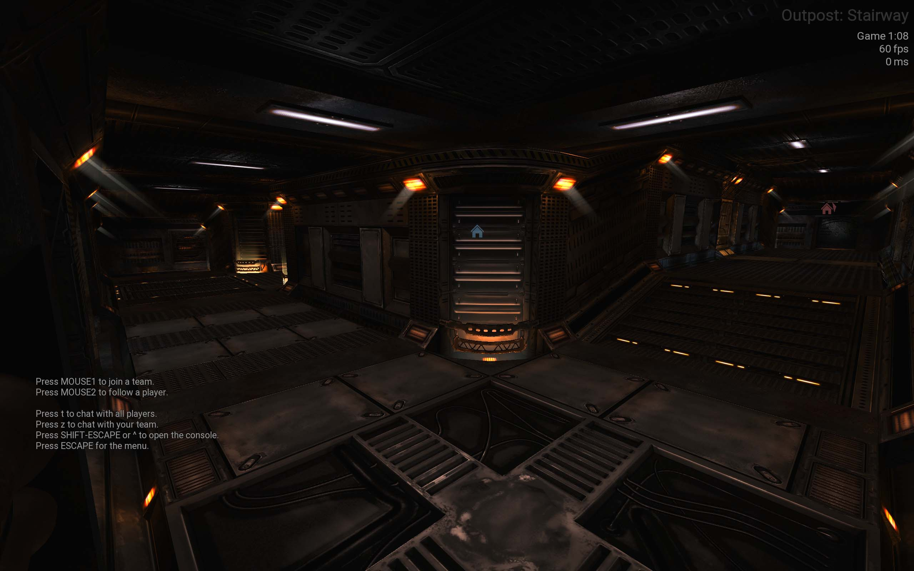 
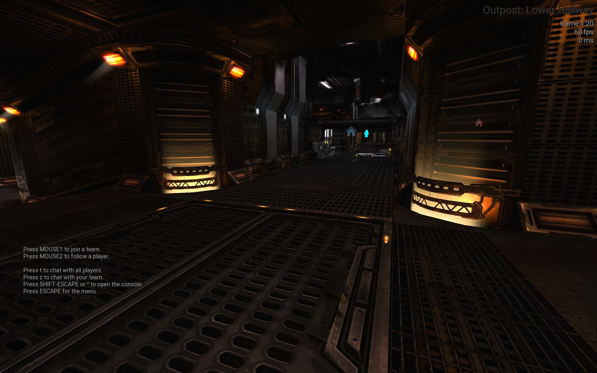 
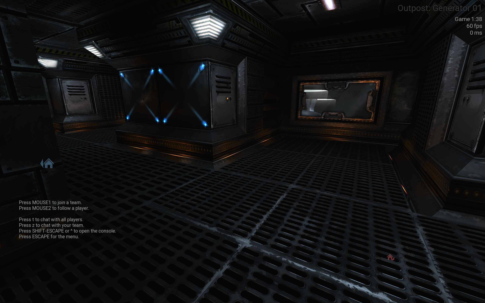 
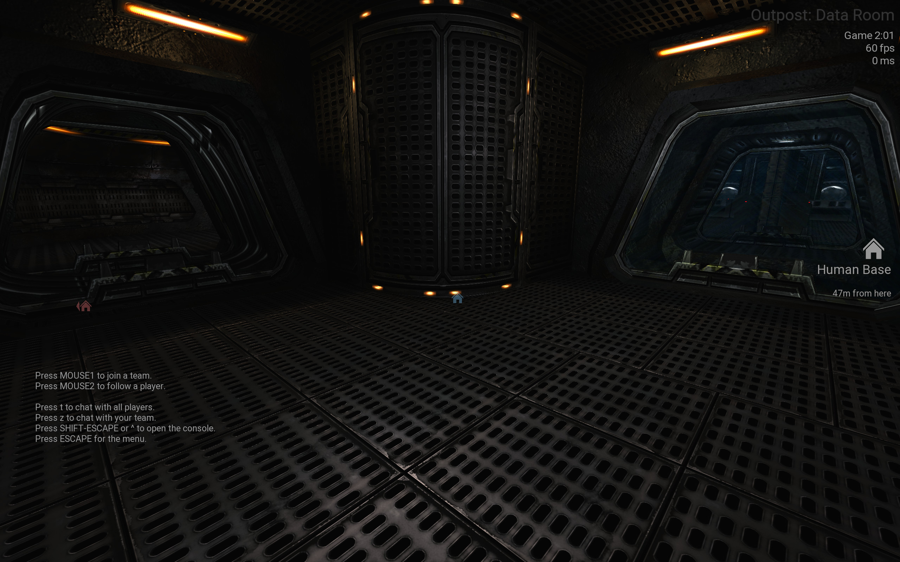 
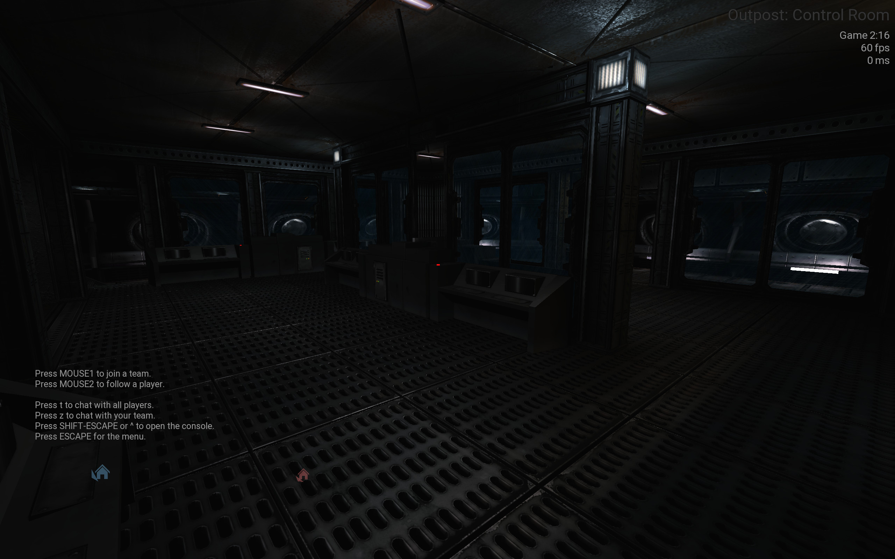 
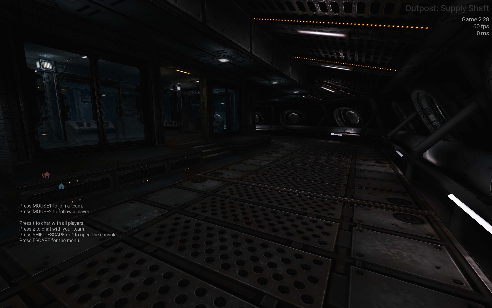 
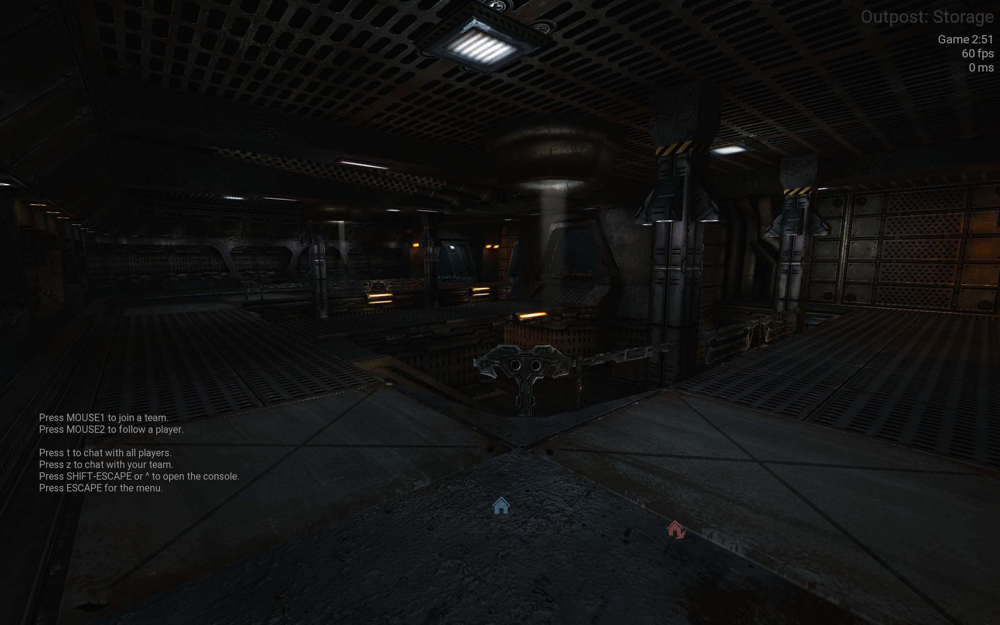 
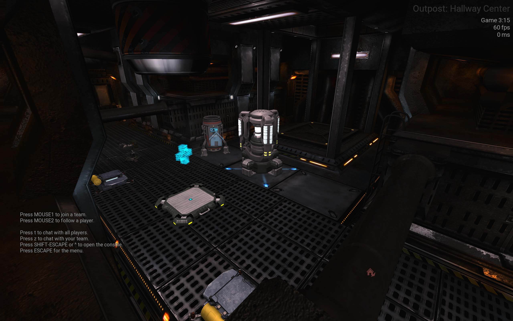 
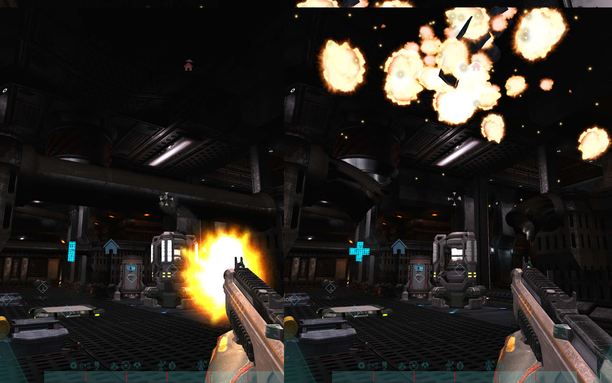 
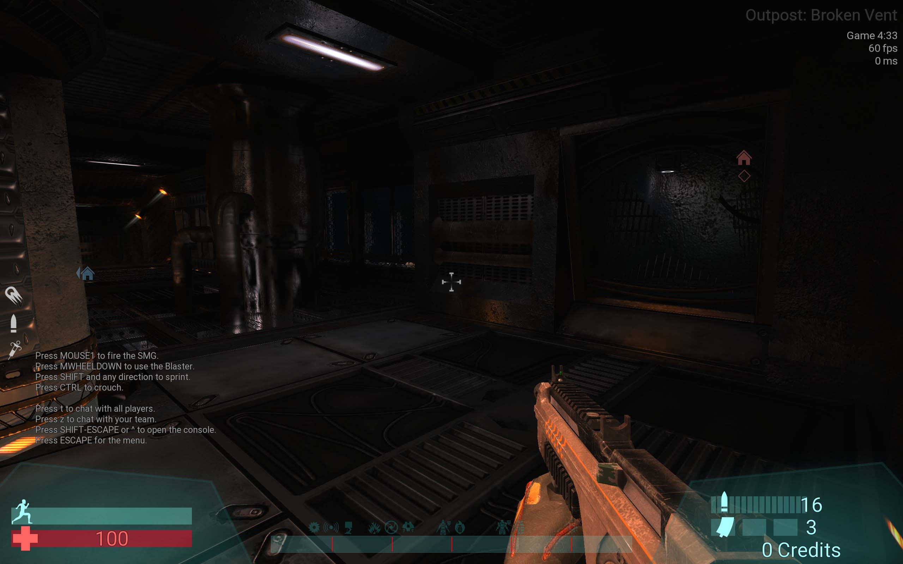 
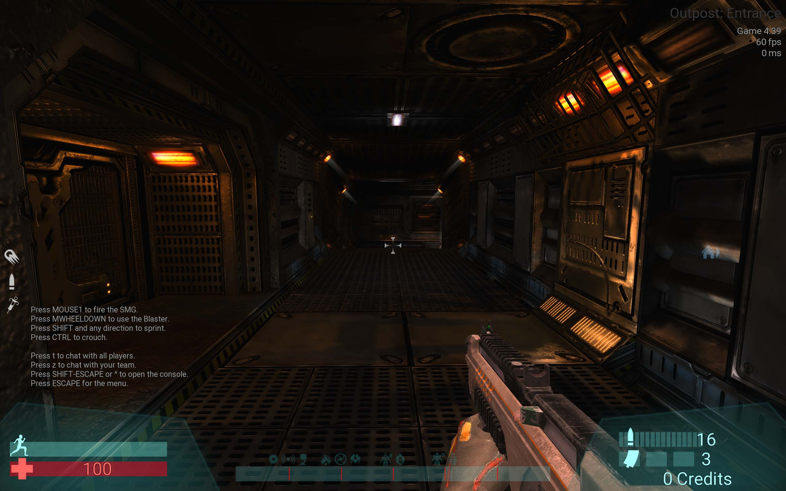 
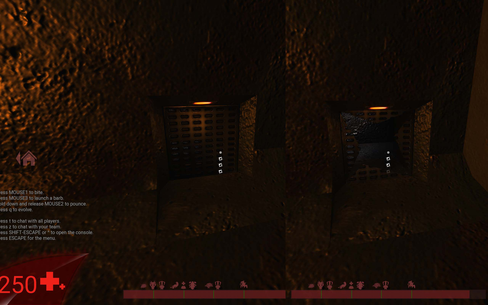
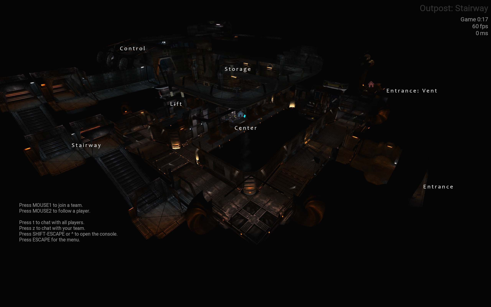 
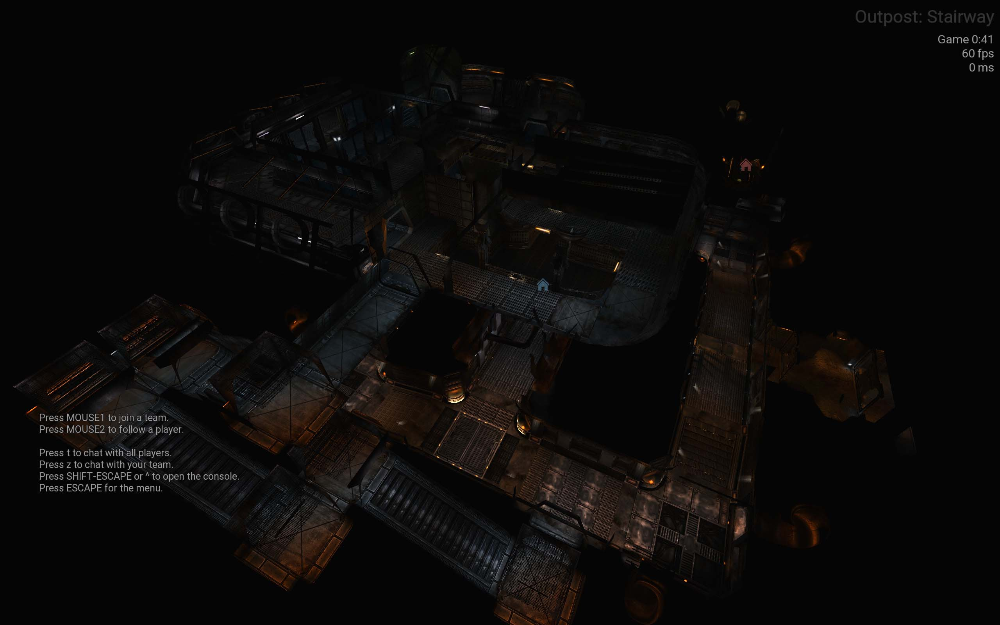

---
12.01.2025:

-After a break, the Human Base is almost complete. It consists of two floors, an elevator, a vertical shaft with ladders, and a staircase.   

 
 
 

---
17.11.2024:

-Small update to the middle area: The Human Base (H, blue) is located in the upper left area, and the Alien Base (A, red)   
in the lower right area. Each base has 3 entrances. The fourth can be considered shared. The areas with pink texture are paths that can be unlocked.

 

---
13.11.2024:

-At the moment, I'm still using the .obj format for models. The problem is exporting to the .iqm format in Blender. Unfortunately, this doesn’t seem to work smoothly with the current version of Blender. 
-I had the idea to use a railway tunnel entrance as a concept. In a sci-fi theme, of course. Along the upper right wall of the tunnel, there should be a kind of groove (at an angled slope), 
which looks cool on one hand, but also a bit strange on the other. Perfect! 
-I'm considering releasing the old stahl.map as a separate branch with Prometheus. Since a lot has changed, the map is no longer correctly textured. I’m not planning to retexture it, so it will remain as it is. 
-The blockout is mostly finished. The level flow includes three connections between the two teams. The short path is intended to be accessible via interaction (build spots).
Right now, a kind of bridge is planned. The idea is to give the teams the option to open or close this path depending on what suits their strategy. 
-The second, longer path has a functional aspect as well. It’s a longer segment made up of pipes and includes a high-damage area, which, like the bridge, can also be triggered.  
The third path is accessible without obstacles. The paths are connected to each other at several points.
-Lastly, here’s a work-in-progress of the alien base. The default base for the aliens should be on the ground. The upper tank-like structure is intended to serve as a better “move spot.”  
These areas are hard for humans to reach, making them strategically advantageous, but they are dead ends. If multiple humans start shooting at this spot, it quickly becomes a death trap.

 
--- 
04.11.2024:

The first terrain tests look quite decent.

 
--- 
03.11.2024:

 
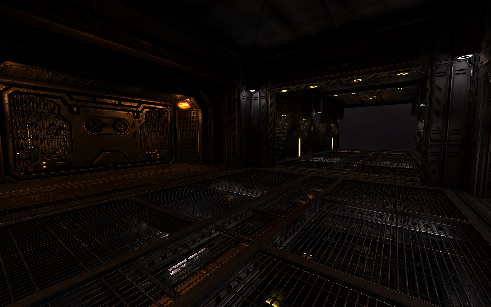 
 
