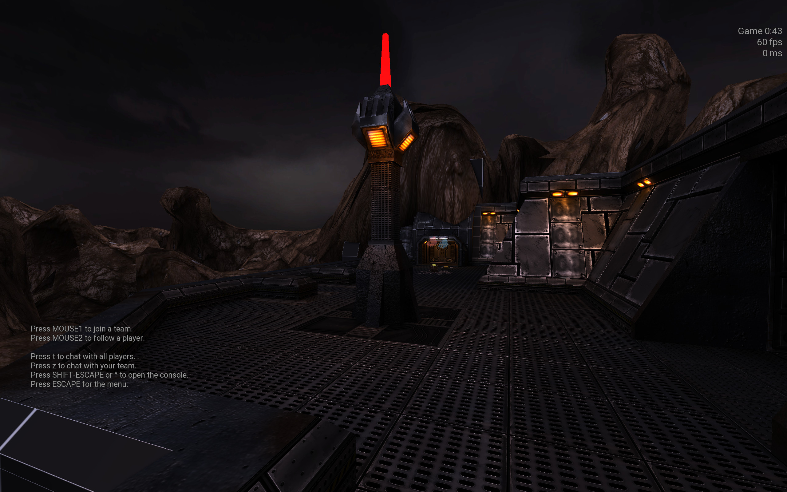

# Prometheus - Development Progress

## Table of Contents
- [February 2025](#february-2025)
- [January 2025](#january-2025)
- [December 2024](#december-2024)
- [November 2024](#november-2024)
- [Earlier Progress](#earlier-progress)

## February 2025
- The alien base is nearly finished, with only one side room missing.
- The skybox has been reworked.
- A mysterious object has appeared near the human base—possibly the entry point for the aliens?

## January 2025
- The central area is halfway complete; work continues on the second half.
- Adjustments to rock textures for better contrast.
- The inner outpost received an additional access point.
- The human spawn area (*Outpost*) is mostly complete, featuring destructible pipes, a storage room, and a control room connected by walkways.

## December 2024
- The human base now consists of two floors, an elevator, a vertical shaft, and a staircase.

## November 2024
- Base layout defined: human base (blue) in the upper left, alien base (red) in the lower right.
- Three primary paths between the bases, with one requiring interaction to unlock.
- Alien base structure designed to provide tactical advantages but also risks.

## Earlier Progress
- First terrain tests looked promising.
- Considered a railway tunnel entrance as part of the map’s theme.
- Testing model export issues in Blender.

